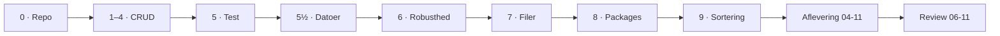
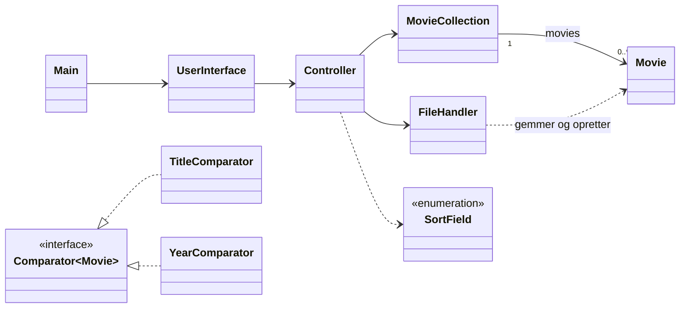

# Projekt: Filmsamling

> Et gruppeprojekt i ét fælles GitHub-repository – uge 43–45.
> **Obligatorisk.** Deadline **onsdag 04-11-2026 kl. 23:59** – se [Aflevering](#aflevering).

## Hylden med film

De fleste har en eller anden form for samling: film på en hylde, en liste i telefonen, en
watchlist hos en streamingtjeneste. Fælles for dem er, at man skal kunne **lægge noget ind**,
**finde det igen**, **rette det** og **smide det ud**.

Det er præcis det, I skal bygge: et konsolprogram, der holder styr på en samling film. Programmet
er et såkaldt **CRUD**-system:

| | Engelsk | Dansk | I filmsamlingen |
|---|---|---|---|
| **C** | Create | Opret | Læg en ny film i samlingen |
| **R** | Read | Læs | Vis alle film, søg efter en film |
| **U** | Update | Opdatér | Ret oplysningerne om en film |
| **D** | Delete | Slet | Fjern en film fra samlingen |

Næsten alle de programmer, I kommer til at skrive på uddannelsen – webshops, bookingsystemer,
medlemsregistre – har CRUD i bunden. Resten er detaljer. Vigtige detaljer, som I skal lære her:
**test**, **robusthed**, **datoer**, **filer** og **sortering**.

### Fra bogsamling til filmsamling

I [Bogsamling](../bogsamling/readme.md) lavede I `Book` og `Library` med en `ArrayList`, og i
[Adventure](../adventure/readme.md) delte I koden op i `UserInterface`, en controller og
domæneklasser. Filmsamlingen starter **der, hvor de to projekter slap**:

* Samlingen er en `ArrayList` fra første dag – ikke et array med fast størrelse.
* Koden er delt op i `UserInterface`, `Controller`, `MovieCollection` og `Movie` fra første dag.
* I kan det hele i forvejen. Det nye er, at I **bygger videre på den samme kode i tre uger** og
  får den til at holde: med tests, der fanger fejl, med input, der ikke kan vælte programmet, og
  med data, der overlever, at programmet lukkes.

---

## Delene

Projektet er delt op, så hver undervisningsdag har sin del. Hver del bygger oven på den forrige –
i det **samme** repository. Del 1–6 svarer til "delopgave 1–6" i lektionsplanen; del 5½ og 7–9 er
udvidelserne med datoer, filer, packages og sortering.

| Del | Dag | Emne | Det lærer du | Bør være færdig |
|---|---|---|---|---|
| [0](del-0-github.md) | man 19-10 | Fælles repository | Git i en gruppe, merge-konflikter | man 19-10 |
| [1–4](del-1-4-crud.md) | tir 20-10 | CRUD og user stories | Klassernes ansvar, `ArrayList`, søgning | inden fre 23-10 |
| [5](del-5-test.md) | ons 21-10 og fre 23-10 | Unit test | JUnit 5, Arrange-Act-Assert | inden man 26-10 |
| [5½](del-5-datoer.md) | man 26-10 | Datoer og FURPS | `LocalDate`, kvalitetskrav | inden tir 27-10 |
| [6](del-6-exceptions.md) | tir 27-10 og ons 28-10 | Robusthed | `try`/`catch`, `throw`, `assertThrows` | inden fre 30-10 |
| [7](del-7-filer.md) | fre 30-10 | Gem og indlæs | Filer, CSV, checked exceptions | inden man 02-11 |
| [8](del-8-refaktorering.md) | man 02-11 | Code review og packages | Review, refaktorering, lag | inden tir 03-11 |
| [9](del-9-sortering.md) | tir 03-11 | Sortering | Interfaces: `Comparable`, `Comparator` | **ons 04-11 kl. 23:59** |
| – | ons 04-11 | Projektvejledning (online) | Gør færdigt og aflevér | **ons 04-11 kl. 23:59** |
| [Review](kode-review.md) | tor 05-11 og fre 06-11 | Code review af en anden gruppes projekt | At læse og vurdere andres kode | fre 06-11 |

Torsdag 22-10 (Delfi-evaluering) og torsdag 29-10 (ITF) er der ikke noget i projektet.

"Bør være færdig" er et **anbefalet tempo**, ikke en aflevering. Der er kun én aflevering: den
endelige, onsdag 04-11. Men hver del bygger på den forrige, og undervisningen dagen efter går ud
fra, at I er nået så langt. Kommer I bagud, så sig det til underviseren i god tid.

### User stories

Kravene står som **user stories** med acceptkriterier – samme format som i uge 39:

> Som *filmentusiast* vil jeg *kunne tilføje en film til min samling*, så *jeg har en liste over
> alle mine film*.
>
> **Givet** at jeg har valgt "Opret en film", **når** jeg har indtastet oplysningerne, **så** er
> filmen lagt i samlingen.

User storyen siger, **hvad** brugeren vil og **hvorfor**. Acceptkriterierne siger, **hvornår** den
er færdig – det er dem, I tester op imod. User stories er nummereret fortløbende gennem hele
projektet (US1–US18; US18 er en ekstraopgave), så I kan skrive nummeret i jeres commit-beskeder: `US4: søgning på del af
titel`.

---

## Gruppearbejde og Git

Projektet laves i **grupper på 2–3 personer**, svarende til en halv studiegruppe – som i
Adventure. Grupperne dannes mandag 19-10. Gruppen har **ét fælles
GitHub-repository**, som alle medlemmer committer og pusher til. Hvordan det sættes op, står i
[del 0](del-0-github.md).

**Alle** i gruppen skal skrive kode og committe den selv. Historikken i GitHub skal vise commits
fra hvert eneste medlem – det er sådan, vi kan se, at I alle har været med.

Vi bruger **ikke branches** i dette projekt – de kommer torsdag 19-11. Alle arbejder direkte på
`main`. Det går fint, hvis I holder jer til fem regler:

> 1. **Pull**, før I begynder at arbejde – hver gang.
> 2. **Én fil – én person ad gangen.** Aftal, hvem der arbejder i hvilken klasse.
> 3. **Små commits**, der hver gør én ting – og skriv hvad (og gerne hvilken user story).
> 4. **Push ofte** – mindst hver gang noget virker. Jo længere I venter, jo større konflikter.
> 5. **Push aldrig kode, der ikke kompilerer.** Resten af gruppen puller den.

Går det alligevel galt, og Git melder en **merge-konflikt**, så gå ikke i panik. I øver det i del 0,
så I ved, hvordan den ser ud, og hvordan den løses.

### Kode, brugerflade og AI

* **Kode på engelsk:** klasser, metoder og variable hedder `Movie`, `addMovie()`, `yearCreated`.
  Kommentarer må gerne være på dansk.
* **Brugerfladen på dansk:** menuen og beskederne til brugeren er på dansk – brugeren er en
  dansk filmentusiast.
* **Ingen AI-assistenter** (fx Copilot eller chatbots, der skriver koden). Almindelig
  kodefuldførelse i IntelliJ er fint. I skal kunne forklare hver linje i jeres eget projekt – til
  code review og senere til eksamen.

---

## Menuen – samlet oversigt

Menuen vokser gennem delene. Sådan ser den ud til sidst:

| Valg | Fra del | Betydning |
|---|---|---|
| `1. Opret en film` | 1 | Indtast en ny film og læg den i samlingen |
| `2. Vis alle film` | 2 | Vis hele samlingen (fra del 9 sorteret efter titel) |
| `3. Søg efter film` | 3 | Vis alle film, hvis titel indeholder søgeteksten |
| `4. Redigér en film` | 4 | Find en film og ret dens oplysninger |
| `5. Slet en film` | 4 | Find en film og fjern den fra samlingen |
| `6. Markér en film som set` | 5½ | Husk, hvornår du sidst så filmen |
| `7. Find film, du ikke har set længe` | 5½ | Film, du ikke har set i et antal dage – eller aldrig |
| `8. Vis film sorteret efter ...` | 9 | Vælg en egenskab at sortere efter (ekstra: to egenskaber) |
| `0. Afslut` | 1 | Afslut programmet (fra del 7 gemmes samlingen først) |

I må gerne formulere teksterne anderledes, bare funktionen er den samme.

---

## Klasserne – samlet oversigt

Sådan ser programmet ud, når del 9 er færdig. Diagrammet viser kun klasserne og deres
forbindelser; metoderne står i de enkelte dele.

(`DirectorComparator`, `LengthComparator` og `GenreComparator` er udeladt – de ligner
`TitleComparator` og `YearComparator`.)

| Klasse | Package (fra del 8) | Ansvar |
|---|---|---|
| `Main` | – | Starter programmet |
| `UserInterface` | `ui` | **Al** input og output: menu, `Scanner`, `System.out` |
| `Controller` | `domainmodel` | Programmets flow; det eneste, `UserInterface` taler med |
| `MovieCollection` | `domainmodel` | Samlingen af film: tilføj, søg, redigér, slet, sortér |
| `Movie` | `domainmodel` | Én film og dens regler |
| `FileHandler` | `datasource` | Gemmer og indlæser filmene i en fil |
| `...Comparator`, `SortField` | `domainmodel` | Sortering |

---

## Aflevering

Filmsamlingen er et **obligatorisk** projekt. De tre obligatoriske projekter – Adventure,
Filmsamling og Delfinen – skal afleveres, for at man kan indstilles til eksamen.

**Deadline: onsdag 04-11-2026 kl. 23:59.**

### Hvor

I itslearning: gå ind i **jeres klasses rum** (E26A og E26B har hver sit) og find
afleveringsopgaven **Filmsamling – aflevering**.

### Hvordan

Opgaven er en **gruppeaflevering** i itslearning:

1. Sørg for, at **alle** gruppens medlemmer er med i jeres gruppe i itslearning, **før** I
   afleverer. Den, der ikke er med i gruppen, har ikke afleveret.
2. **Ét** medlem afleverer på hele gruppens vegne.
3. Afleveringen er **ét klikbart link til gruppens GitHub-repository** – til repositoriet som et
   hele, ikke til en fil eller en mappe. Præcis som i Adventure.

Repositoriet skal være **public**. Test linket i et privat browservindue (hvor I ikke er logget
ind på GitHub): kan I se koden der, kan underviseren og den gruppe, der skal reviewe jer, også.

### Krav for at få afleveringen godkendt

Repositoriet skal indeholde koden – programmet skal kompilere og kunne køre. Derudover er **alle
fem** punkter herunder **krav**. Mangler ét af dem, er afleveringen ikke godkendt:

- [ ] **`README.md`** i roden af repositoriet med:
  - **fornavn og GitHub-brugernavn** på hvert gruppemedlem
  - **hvordan man kører programmet** (hvilken klasse har `main`, hvilken JDK)
  - gerne også: hvilke user stories I har lavet – og ærligt, hvilke I ikke nåede
- [ ] **Klassediagram** over det færdige program i mappen `docs` – som Mermaid i
      `docs/klassediagram.md` eller som billede/pdf, tegnet af jer selv (fx i draw.io), ikke
      autogenereret af IntelliJ.
- [ ] **`docs/furps.md`** fra [del 5½](del-5-datoer.md) – mindst ét krav pr. FURPS-bogstav.
- [ ] **Tests, der kører grønt** – jeres JUnit-tests under `src/test/java`.
- [ ] **Commits fra hvert eneste medlem** af gruppen, synlige i historikken på GitHub.

> **Er I ikke nået alle user stories, så aflevér alligevel** – de fem krav ovenfor skal være
> opfyldt, men skriv i README'en, hvilke user stories der mangler. Et link, der er afleveret til
> tiden, er langt bedre end intet link.
>
> **Aflevér det, I har, inden deadline, og skriv i afleveringen, hvad der mangler.** Opgaven i
> itslearning lukker ved deadline – der er ingen aflevering efter.

### Efter afleveringen

Fredag 06-11 laver grupperne **code review** af hinandens afleverede projekter efter
[review-skemaet](kode-review.md): underviseren parrer grupperne, og de to grupper sidder sammen og
reviewer **hele gruppe mod hele gruppe** hinandens kode på skift. Torsdag 05-11 (uden underviser)
forbereder I jer ved at clone og læse den anden gruppes kode. Reviewet foregår på den version,
der ligger på `main` på GitHub, når reviewet starter.

Datoerne står også i [projektoversigten på forsiden](../../README.md#afleveringer-og-deadlines).

---

## Klar?

Start med [del 0 – Fælles repository](del-0-github.md).
